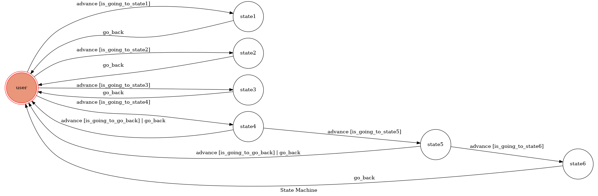

## Run the sever

```sh
python3 app.py
```

## Finite State Machine


## Usage
The initial state is set to `user`.

Every time `user` state is triggered to `advance` to another state, it will `go_back` to `user` state after the bot replies corresponding message.

* In user state
	* Input: "go to state1"
		* Reply: "I'm entering state1"
	* Input: "go to state2"
		* Reply: "I'm entering state2"
    * Input: "go to state3"
		* Reply: "I'm entering state3"
	* Input: "go to state4"
		* Reply: "I'm entering state4"

* In user state4
	* Input: "go to state5"
		* Reply: "I'm entering state5"
    * Input: "go back"
		* Reply: "Leaving state4"

* In user state5
	* Input: "go to state6"
		* Reply: "I'm entering state6"
    * Input: "go back"
		* Reply: "Leaving state5"